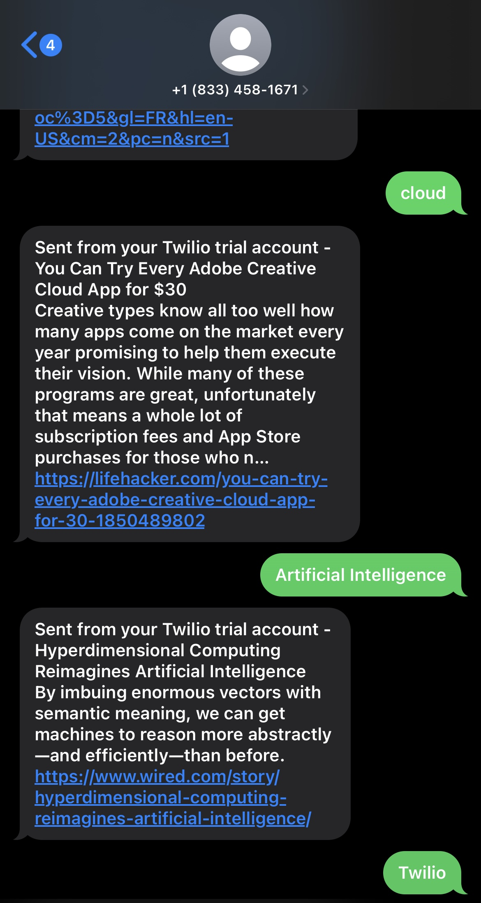

# Twilio Personalized News Bot

This project is a Personalized News Bot that uses the NewsAPI to fetch the latest news based on keywords provided by the user via SMS. The Bot uses Twilio to receive and send SMS and is built using Flask.



## Project Structure

The project contains the following files:
1. news.py: This is the main application file. It contains the Flask application and all the logic for handling incoming messages, fetching news, and sending responses.
2. .env: This file contains environment variables which include the Twilio Account SID, Auth Token, Phone Number and NewsAPI Key.
3. requirements.txt: This file lists the Python dependencies that need to be installed for the project

## Setup and Installation

### Prerequisites
- Python 3.7 or later
- A Twilio account with an active phone number
- NewsAPI account
- ngrok for local development

## Steps to run the application
1. Clone the repository to your local machine.
2. Navigate to the project directory.
3. Install the required dependencies. ```pip install -r requirements.txt```
4. Copy the .env.example to a new file named .env and fill in your Twilio Account SID, Auth Token, Phone Number and NewsAPI Key.
5. Run Flask application
6. Open a new terminal window and start ngrok on the same port where your Flask app is running ```ngrok http 5000```
7. Copy the ngrok forwarding URL and set it as the webhook for incoming messages in your Twilio phone number settings.
8. Send a message with a keyword to your Twilio phone number, you should receive a news article related to that keyword.
